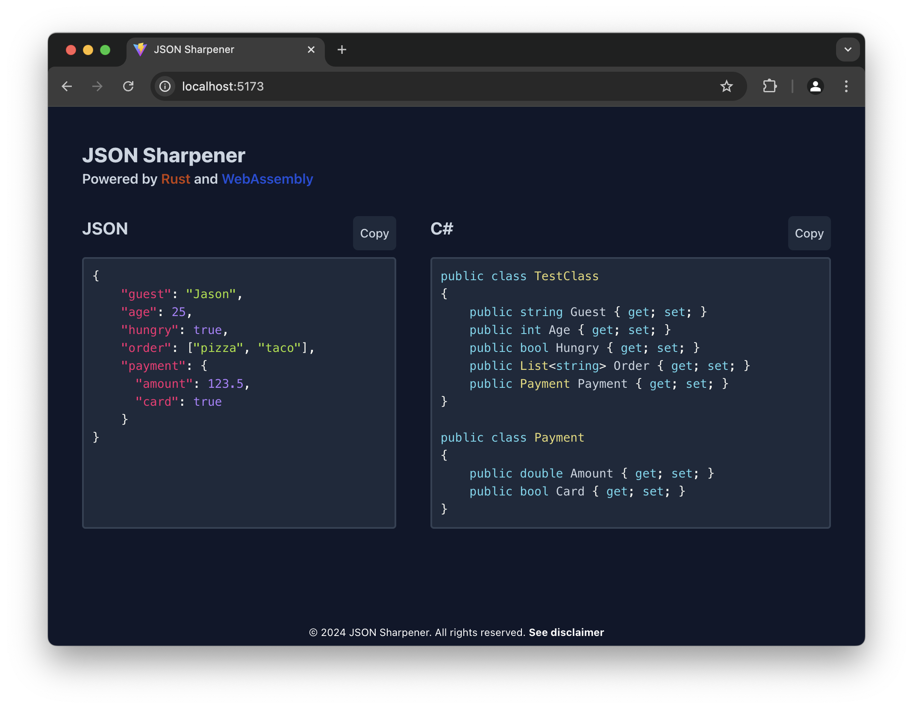

# JSON Sharpener {⚡️}

[](https://github.com/larsjuvik/json-sharpener/actions/workflows/CI.yml)
[](https://github.com/larsjuvik/json-sharpener/actions/workflows/CD.yml)

Sharpen your JSON files with `json-sharpener` - a `library`/`CLI-tool`/`web-app` for easy JSON to `C#` converison.



## Folders :file_folder:

- `json-sharpener` - the core library for parsing JSON to C#
- `json-sharpener-terminal` - terminal parser that uses the core library
- `json-sharpener-wasm` - a WebAssembly wrapper around the core library
- `json-sharpener-web` - website that uses the WebAssembly core library

## Terminal Application :rocket:

```bash
Usage: json-sharpener [OPTIONS] <FILE>

Examples:
json-sharpener response.json
json-sharpener --class-name Converted response.json
json-sharpener --help
```

### Build

```bash
cargo build --release -p json-sharpener-terminal
```

## Web Application

### Docker :whale:

```bash
docker build -t json-sharpener-web .
docker run -p 8080:80 json-sharpener-web
```

### Without Docker

Before running below step make sure the Rust compiler and `wasm-pack` is installed (used for building WASM library of `json-sharpener`).

```bash
cd ./json-sharpener-web/
npm run build-wasm && npm run dev
```
